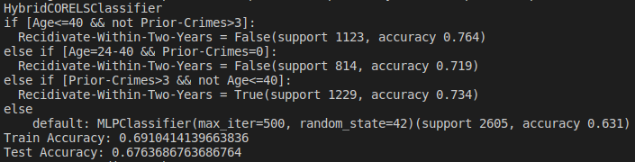

## Python Module for Learning Hybrid Interpretable (Rule-Based) & Black Box models

Example Hybrid Model learnt on the COMPAS dataset using HybridCORELS along with a standard sklearn MLPClassifier as black-box model.

